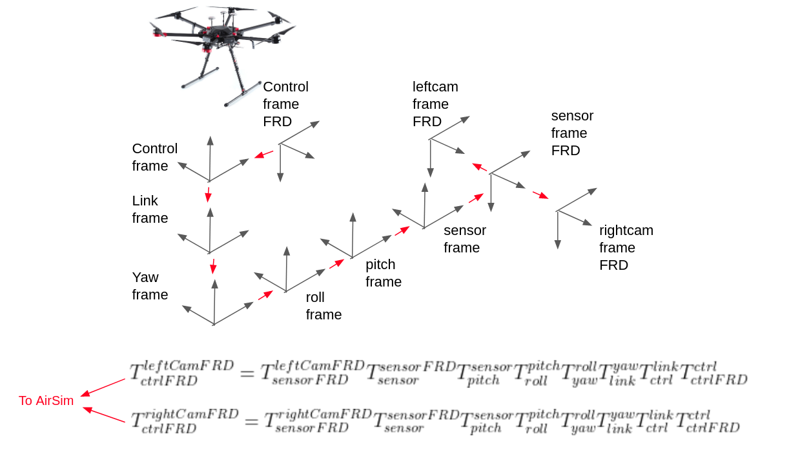
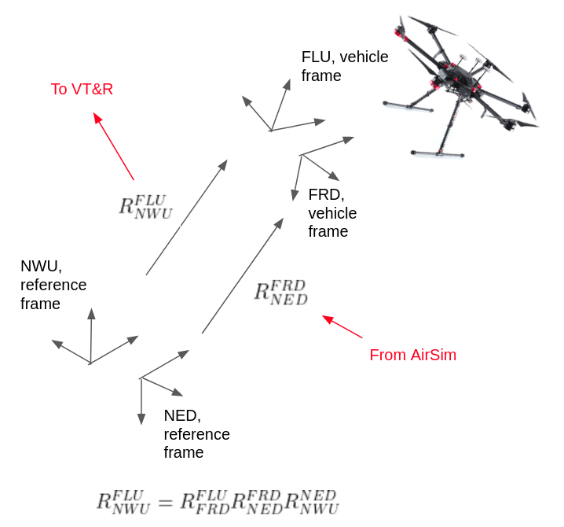

# AirSim Stereo Gimbal

This document illustrates the details of the custom gimbal implementation in AirSim. The gimbal is implemented in `airsim_gimbal_controller.py`

## Overview

This stereo gimbal simulates the behaviour of the [ronin-mx gimbal](https://www.dji.com/ca/ronin-mx) used by the DJI M600, and carries the [ZED stereo camera](https://www.stereolabs.com/zed/) used by VT&R. 

All the reference frames and joints for the gimbal implementation were retrieved from the `m600_urdf.xml`, available in the `asrl__dji` package. 

The airsim stereo gimbal controller in `airsim_gimbal_controller.py` simulate all the ronin gimbal linkages and outputs the poses of the right and left stereo cameras to airsim. The current implementation simulate constant speed motion in the roll, pitch and yaw directions, the speed of motion can be set using the ros parameter `/airsim_gimbal_controller/gimbal_angle_thres` in `airsim_interface.launch`. 

The `airsim_gimbal_controller.py` publishes to all the topics required by `ronin_gimbal.cpp` in order to run the VT&R gimbal controller. 

The topics published are as follows:

* `/dji_sdk/gimbal_angle` gimbal joint angles
* `/dji_sdk/attitude` M600 attitude
* 

## Gimbal Implementation

 

## Attitude 

