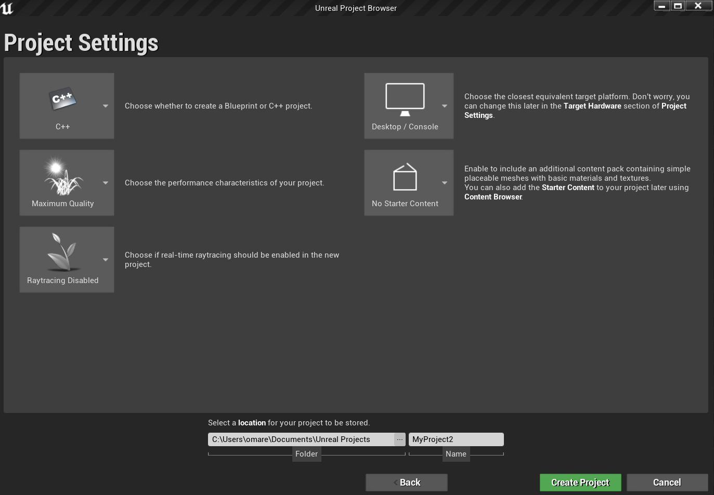
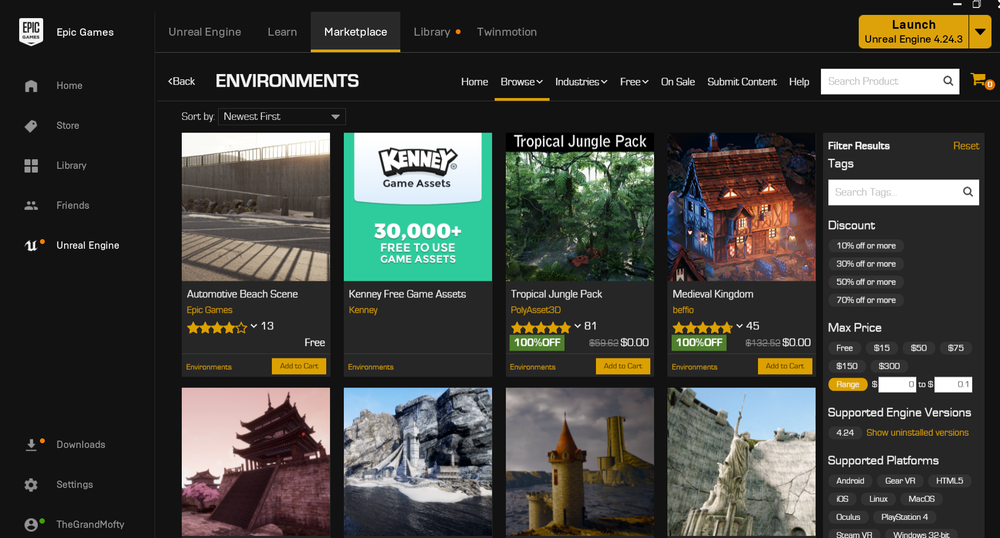
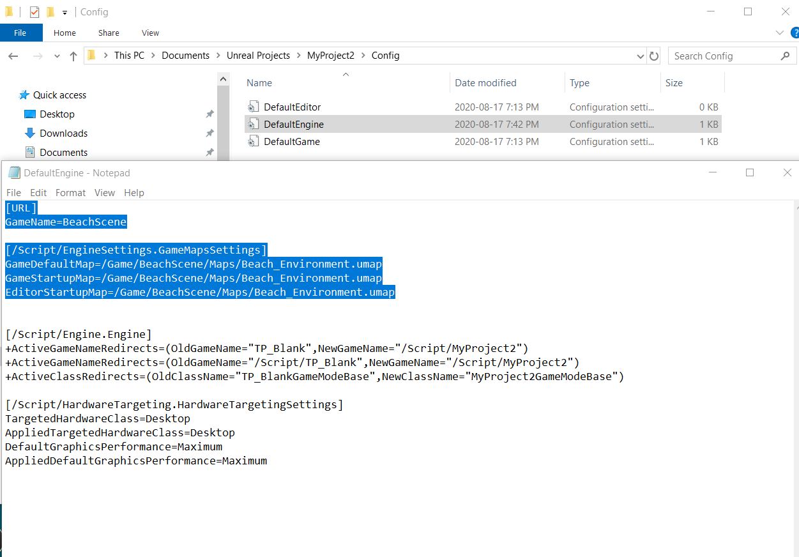
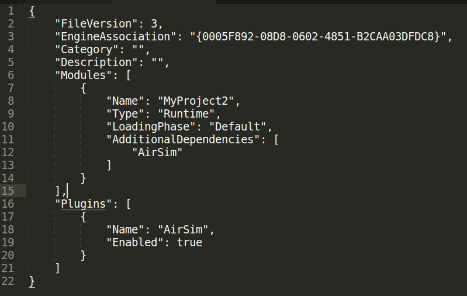
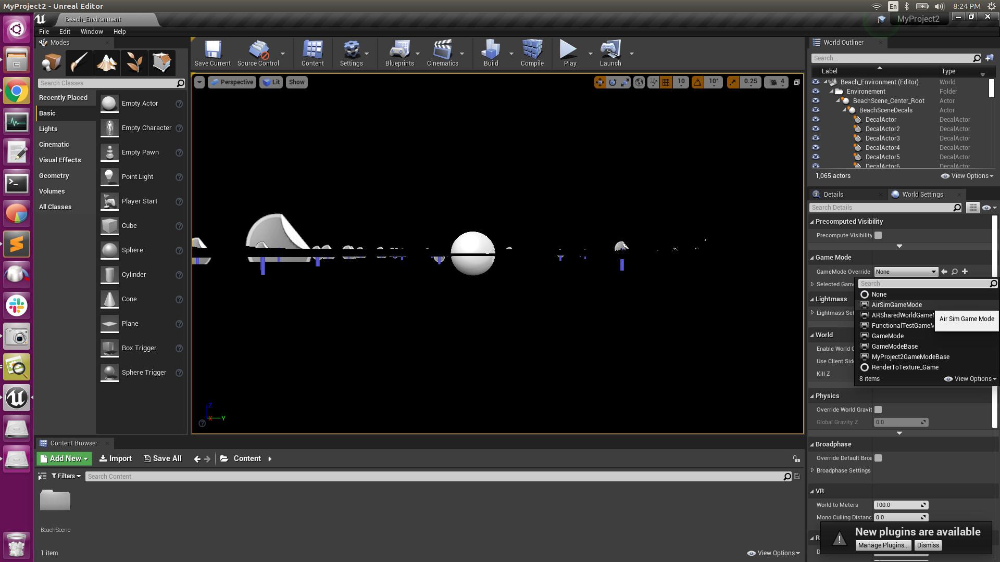
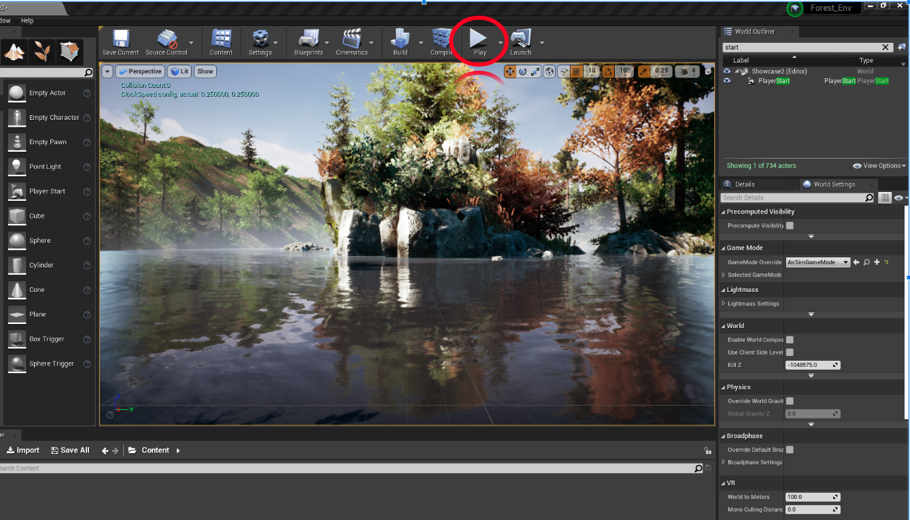
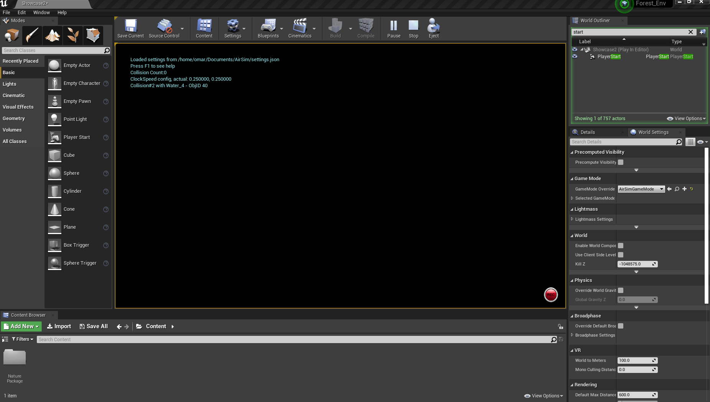
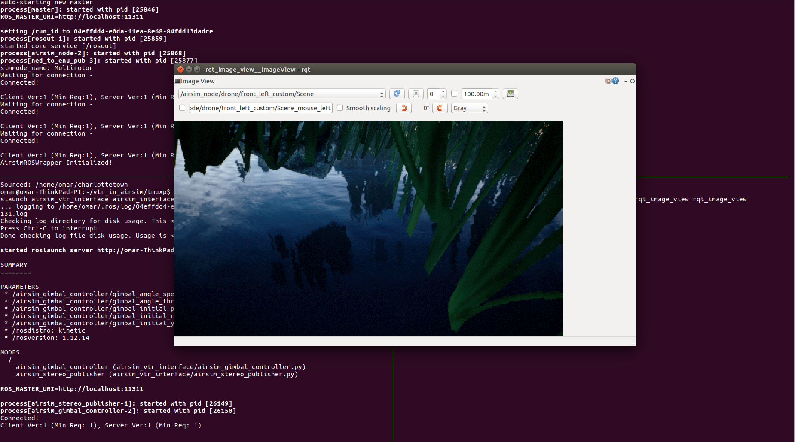
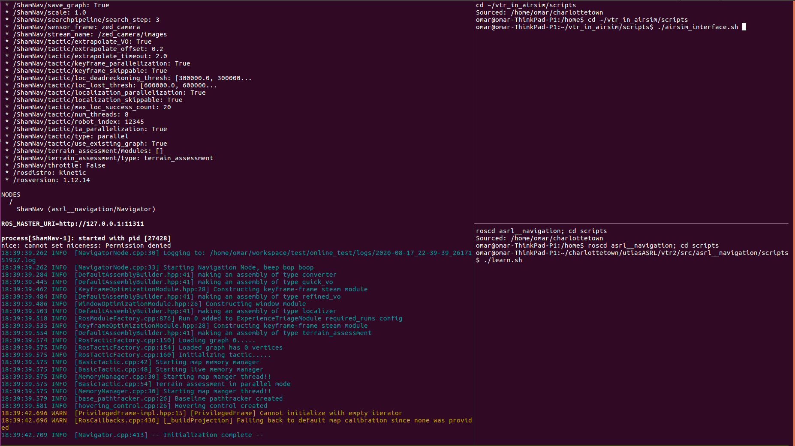

# VT&R in AirSim

This repository is home for the required packages and instructions to run VT&R in AirSim

**Top-level Contents**
* [Repository Overview](#RepoContents)
* [Install Unreal Engine](#UnrealEngine)
* [Install AirSim](#InstallAirSim)
* [Install AirSim ROS Wrapper](#InstallRos)
* [Setup Python Client](#SettingPython)
* [Setup Unreal Environment](#SettingEnv)
* [Install AirSim Interface](#AirSimInterface)
* [Pre-launch Setup](#SettingVTR)
* [Run VT&R in AirSim](#RunningVTR)
* [Reference Material](#Reference)


## Repository Overview <a name="RepoContents"></a>

This is a high-level overview of all the contents of this repository.

* `Plugins`  *a backup version of the Plugins folder with M600 Implementation, the folder is required to run airsim with Unreal editor*
* `airsim_vtr_interface` *a catkin package for interfacing airsim with VT&R*
* `scripts`  *contains some useful bash scripts*
* `tmuxp`  *contains the yaml files required for running VT&R with airsim*
* `Airsim_Changes.md`  *a document containing all the changes made to airsim's master branch to implement the DJI M600 in it*
* `AirSim_Stereo_Gimbal.md` *a document containing all the details regarding the custom stereo gimbal*
* `settings.json` *the required airsim settings file for running VT&R*
* `stereo.yaml`  *the required parameter file for babelfish_robochunk_translator to accept the airsim topics*

## Install Unreal Engine <a name="UnrealEngine"></a>

To install Unreal Engine, clone the below repository and build it. You'll have to first create an EpicGames Account to be able to access the repository.

```
cd ~
git clone -b 4.24 https://github.com/EpicGames/UnrealEngine.git
cd UnrealEngine
./Setup.sh
./GenerateProjectFiles.sh
make
```

To launch Unreal Editor to test installation:
```
cd ~/UnrealEngine/Engine/Binaries/Linux/
./UE4Editor
```
The new project Window should open, you can create an empty project to test that the editor works. 

Note that Unreal Engine uses Vulkan Drivers, if you are using Ubuntu 16.04 they might not be installed by default. If you receive a warning message "opengl is deprecated please use vulkan" upon launching Unreal Engine, then you need to install vulkan using the below command.
```
sudo apt install -y libvulkan1 vulkan-utils
```

## Install AirSim <a name="InstallAirSim"></a>

Install AirSim from the following forked repository, the forked repository has changes are not available on AirSim's master branch.  All the changes are presented in the doc [AirSim_Changes.md](https://github.com/Omar-Elmofty/VT-R_in_AirSim/blob/master/AirSim_Changes.md) for reference. The changes are primarily adapting the simulator to work with the hexacopter model of the M600. If you would like to make any changes to the M600 dynamics model, please refer to that doc. Run the following commands to install AirSim.
```
cd ~
git clone https://github.com/Omar-Elmofty/AirSim.git
cd AirSim
./setup.sh
./build.sh
```
Once AirSim is built, a "Plugins" Folder will be created under `~/AirSim/Unreal`, this folder will be later attached to unreal projects in order to run AirSim with Unreal editor. Note that a backup version of the "Plugins" folder is attached to this repository for reference only.

## Install AirSim ROS Wrapper <a name="InstallRos"></a>

#### Upgrade gcc
You'll need gcc >= 8.0.0, check the version of gcc using `gcc --version`. Run the following commands to install gcc 8 if you don't have it:
```
sudo apt-get install gcc-8 g++-8
```
If you encounter issues running the above command, you might need to add the ppa repository as shown below.

```
sudo add-apt-repository ppa:ubuntu-toolchain-r/test
sudo apt-get update
sudo apt-get install gcc-8 g++-8
```
#### Upgrade CMake
You'll also need C-make >= 3.10.0, which is not installed by default with VT&R.

To install the latest C-make version follow the below instructions

Visit https://cmake.org/download/ and download the latest binaries
I used `cmake-3.17.3-Linux-x86_64.sh`, copy the binary to /opt/

run `chmod +x /opt/cmake-3.17.3-Linux-x86_64.sh` 
run `sudo bash /opt/cmake-3.17.3-Linux-x86_64.sh*` (you'll need to press y twice)

The script installs to `/opt/cmake-3.17.3-Linux-x86_64*` so in order to get the cmake command, make a symbolic link:

`sudo ln -s /opt/cmake-3.17.3-Linux-x86_64/bin/* /usr/local/bin`

Test your results with `cmake --version`

If the cmake version does not change, then you might need to export paths as shown below

```
export PATH=/opt/cmake-3.17.2-Linux-x86_64/bin:$PATH
export CMAKE_PREFIX_PATH=/opt/cmake-3.17.2-Linux-x86_64:$CMAKE_PREFIX_PATH
```

#### Install tf2 sensor and mavros
Finally, you'll also need tf2 sensor and mavros packages, install them using the below command:

`sudo apt-get install ros-kinetic-tf2-sensor-msgs ros-kinetic-mavros*`

#### Build ROS Wrapper

To build Ros Wrapper
Open a new terminal, export the cmake paths if you need to, then build ros package

```
cd ~AirSim/ros
catkin build -DCMAKE_C_COMPILER=gcc-8 -DCMAKE_CXX_COMPILER=g++-8
```

If you encounter any issues in finding the directories of some of the dependencies, you could set the directories in the `CMakeLists.txt` of the `airsim_ros_pkgs` and `airsim_tutorial_pkgs` packages. Below are some examples of the directories that needed to be set at the time of writing this document, the below lines were added to `CMakeLists.txt` of both packages, before `find_package` command.
```
set(mavros_msgs_DIR "/opt/ros/kinetic/share/mavros_msgs/cmake") 
set(geographic_msgs_DIR "/opt/ros/kinetic/share/geographic_msgs/cmake")
set(uuid_msgs_DIR "/opt/ros/kinetic/share/uuid_msgs/cmake")
```

## Setup Python Client <a name="SettingPython"></a>

To setup the AirSim python package run the following
```
cd ~/AirSim/PythonClient
sudo python setup.py install
```
Now `import airsim` should work in a python script.

The different functions available in the python api can be found in `~/AirSim/pythonClient/airsim/client.py`

Different Examples of the python client usage can be found in `~/Airsim_Forked/PythonClient/multirotor`

## Setup Unreal Environment <a name="SettingEnv"></a>

To setup an unreal environment, you'll have to download Epic Launcher and Unreal Engine 4.24 on a Windows machine, then transfer the project to Ubuntu. Instructions for downloading Unreal in windows can be found [here](https://github.com/microsoft/AirSim/blob/master/docs/build_windows.md), note that you don't have to install AirSim in Windows, only Epic Launcher and Unreal Engine are needed. 

This [video](https://www.youtube.com/watch?v=1oY8Qu5maQQ&t=305s) along with this [guide](https://microsoft.github.io/AirSim/unreal_custenv/) have instructions on how to setup the environment in Windows, we'll be following a slightly modified approach since we will be building the AirSim Plugin in Ubuntu rather than Windows. Although it is good to watch the video to gain some background on the setup process.

Once you have download Epic Launch and Unreal Engine 4.24, follow the below steps to setup the environment.

#### Step 1 - Create New Project

* Open Unreal Editor and create new project.
* Select "Games" then click next.
* Select "Blank" then click next.
* Select "C++" project, and "No Starter Content" as shown in the below image

 

#### Step 2 - DownLoad an Environment from Epic Launcher

* Open Epic Launcher
* Navigate to Unreal Engine MarketPlace
* Browse for Free Environments (could use the price filter)

 

* Select the environment you like, then checkout cart, you'll then see an option called "Add to Project", click on that and select the project you just created. This is going to download the new environment in the project. After the download is done, you should the maps and assets under the "Content" folder of the project.

#### Step 3 - Edit DefaultEngine.ini

Navigate to the "Config" folder in your project, and open `DefaultEngine.ini`, add the following highlighted lines in the below picture. These lines will load the map of the environment you downloaded once the Unreal Editor is launched. Note that the path to the `.umap` will be different for your project.

 

#### Step 4 - Build Environment using Visual Studio

* Open the visual studio solution file in your project
* Select "DebugGame Editor" and "Win64" build configuration 
* Click "Run" (or press F5), the building process will start and might take several minutes. After the environment is built, the Unreal Editor should automatically open and you should see the Environment loaded (note that shaders might take a while to compile, so you might not see the environment rendered properly right away).

**Now you should copy the project over to your Ubuntu machine**

#### Step 5 - Build the Project with AirSim Plugin

* Copy and paste the "Plugins" folder from AirSim (`~/AirSim/Unreal/Plugins`), and paste it into your project
* Open the `PROJECT_NAME.uproject` file using a text editor
* Add the "Additional Dependencies" and "Plugins" fields, as shown below

 

* Build your project by double clicking your `PROJECT_NAME.uproject` file, you should get prompted to whether you want to build your project and the airsim plugin, select yes. The build process will start and might take several minutes, so be patient with it.


#### Step 6 - Select Game Mode and set Player Start

* Select "AirSimGameMode" as shown below

 

* Select a new player start position as shown in the [video tutorial](https://www.youtube.com/watch?v=1oY8Qu5maQQ&t=305s)

#### Step 7 - **Very Important** Ensure Unreal Engine Can Run in the Background

In order to avoid Unreal Engine from dropping in performance while running VT&R, ensure it can run in the background. Go to "Edit -> Editor Preferences"; in the "Search" box, type "CPU" and ensure that the **"Use Less CPU when in Background"** is **unchecked**. If this step is not completed, the camera frame rate might drop significantly while Unreal Editor is running in the background, which will create issues while running VT&R. 


## Install AirSim Interface <a name="AirSimInterface"></a>

The `airsim_vtr_interface` package is a custom Package meant to interface AirSim with VT&R. The package is available in this repository. 

Clone the repository
```
cd ~
git clone https://github.com/Omar-Elmofty/vtr_in_airsim.git
```

Create a catkin workspace
```
mkdir -p ~/airsim_interface/src
cd ~/airsim_interface/
catkin_make
```

Copy and paste package to `airsim_vtr_interface` into new workspace
```
cp -R ~/vtr_in_airsim/airsim_vtr_interface ~/airsim_interface/src
```

Build workspace
```
cd ~/airsim_interface/
catkin_make
```

**Important Note**: the `airsim_vtr_interface` package depends on the DJI SDK ros wrapper `dji_osdk_ros`, depending on which version of the sdk you have, the actual ros wrapper name might differ from `dji_osdk_ros`. If the package name is different, you'll have to change its name in `airsim_gimbal_controller.py`, `airsim_command_drone.py` and `package.xml`.

Also, additional documentation on the custom gimbal which is implemented in `airsim_gimbal_controller.py` can be found in the doc [AirSim_Stereo_Gimbal.md](https://github.com/Omar-Elmofty/VT-R_in_AirSim/blob/master/AirSim_Stereo_Gimbal.md).

## Pre-launch Setup <a name="SettingVTR"></a>

#### 1. Copy `stereo.yaml`

Copy `stereo.yaml` available in this repo and paste in in the `babelfish_robochunk_translator` package. `stereo.yaml` contains all the correct names of all the ros topics published from the airsim interface. 

```
cp ~/vtr_in_airsim/stereo.yaml ~/charlottetown/utiasASRL/vtr2/build/deps/robochunk_babelfish_generator/translator/robochunk/src/babelfish_robochunk_translator/param/ros_to_rig_images
```
#### 2. Copy `settings.json`

Finally, you'll have to copy the `settings.json` file in this repo to your Documents folder 
```
mkdir ~/Documents/AirSim
cp ~/vtr_in_airsim/settings.json ~/Documents/AirSim
```

The `settings.json` contains all the settings required by AirSim to load the drone and its sensors, the file you just copied contains basics needed to run VT&R, however a lot more customization could be applied to the drone. Check [AirSim Settings Documentation](https://microsoft.github.io/AirSim/settings/) for more details.

#### 3. Use Grayscale images

Open `m600_backyard.yaml` 

`gedit ~/charlottetown/utiasASRL/vtr2/src/asrl__navigation/param/scenarios/m600_backyard.yaml`

Ensure you are using gray-scale images, you could also use color constant images

```
converter/extraction/conversions: ["RGB_TO_GRAYSCALE"]
converter/extraction/extractor/channels: ["grayscale"]
```

#### 4. Adjust Gimbal Parameters (if needed)

Open `airsim_interface.launch` in `airsim_vtr_interface`, adjust the ros parameters in the file to change the gimbal joint speed, and initial joint angles. 

#### 5. Adjust drone's PID gains (if needed)

To edit all the pid gains for the drone, open `airsim_command_drone.py` in `airsim_vtr_interface` package, and adjust the gains in functions `update_anglerate_gains`, `update_angle_gains`, `update_velocity_gains`, and `update_position_gains`. Note that the gains are already tuned for the DJI M600. 

## Run VT&R in AirSim <a name="RunningVTR"></a>

#### Step 1 - Load Environment
Load the Unreal environment by either double clicking the `.uproject` file, or by running it from command line as follows:

```
cd ~/UnrealEngine/Engine/Binaries/Linux/
./UE4Editor PATH_TO_PROJECT/PROJECT_NAME.uproject 

```
Once the Unreal Editor opens, click the **Play** button on the top bar of the Editor. 

 

Confirm that you are not receiving any errors in the editor, errors will be highlighted in red.

 

Also, note that the display in the unreal editor is turned off, that is to help decrease the computational load, and hence increase the camera publishing frequency from AirSim. The live feed from the camera will be displayed using `rqt_image_view` package later on. To turn on display again, you could change the ViewMode in `settings.json`, check the AirSim [settings documentation](https://microsoft.github.io/AirSim/settings/) for more details.

#### Step 2 - Launch AirSim ROS Wrapper and Interface
Load `airsim.yaml` using tmuxp. This will initiate the ros wrapper, the stereo images publishers, the AirSim gimbal controller, and the rqt image viewer.

```
cd ~/vtr_in_airsim/tmuxp
tmuxp load airsim.yaml
```
You should now see a window pop up with the live camera feed from airsim.

 


#### Step 3 - Launch VT&R

Launch VT&R by running the following commands

```
cd ~/vtr_in_airsim/tmuxp
tmuxp load vtr2_m600_airsim.yaml
```

The `vtr2_m600_airsim.yaml` is a slightly modified version of the `vtr2_m600_backyard.yaml` file in `asrl__navigation` package.

After the file is loaded you should see three panes
* The left pane is running VT&R
* The top right pane is for controlling the drone in airsim by running `./airsim_command_drone.sh`
* The bottom right pane is for initiating learn or return by running `./learn.sh` or `./return.sh`

 


#### Step 4 - Teach

Start the teach pass, first you'll have to start moving the drone. Navigate to the top right pane as described in step 3, and run the following command:

```
./airsim_command_drone.sh
```

The drone now should take off vertically first, then start moving in the horizontal plane in an arc.

After the drone finishes taking off, you can start the teach phase by navigating to the bottom right pane, and running the following

```
./learn.sh
```

If you would like to create a different mission plan, you could do that by editing `airsim_command_drone.py` in `airsim_vtr_interface` package, there are a handful of functions in there that could be used or edited for commanding the drone. Also, you could check the [AirSim API documentation](https://microsoft.github.io/AirSim/apis/) for more details on how to the move the drone.

#### Step 5 - Repeat
 
Once the top right pane (running `airsim_command_drone.py`) prints the message `Initiating Return Phase Control Loop`, this indicates that the drone has completed its mission and is ready for return, you could then start the return phase by running the following in the bottom right pane:

```
./return.sh
```
Once the top right pane prints `Reached End, Hovering` this indicates the end of the repeat run.

## Rendering HexaCopter in AirSim

Follow this [tutorial](https://github.com/microsoft/AirSim/wiki/hexacopter) for rendering a hexacopter in AirSim.


## Reference Material <a name="Reference"></a>

[Official AirSim Documentation](https://microsoft.github.io/AirSim)

[AirSim Installation Instructions for Linux](https://microsoft.github.io/AirSim/build_linux/)

[AirSim ROS Wrapper Documentation](https://microsoft.github.io/AirSim/airsim_ros_pkgs/)

[AirSim Settings Documentation](https://microsoft.github.io/AirSim/settings/)

[Great AirSim Guide Created by Jacopo Panerati Part1](https://github.com/JacopoPan/a-minimalist-guide/blob/master/Part3-Using-AirSim.md)

[Great AirSim Guide Created by Jacopo Panerati Part2](https://github.com/JacopoPan/a-minimalist-guide/blob/master/Part4-Modifying-AirSim.md)

